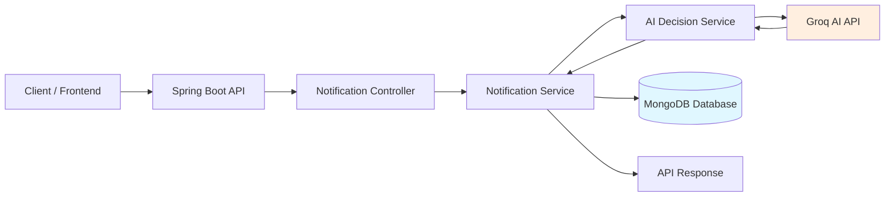
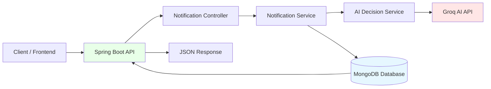
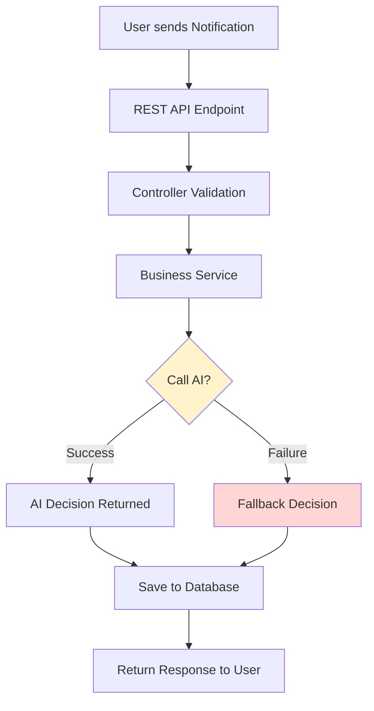
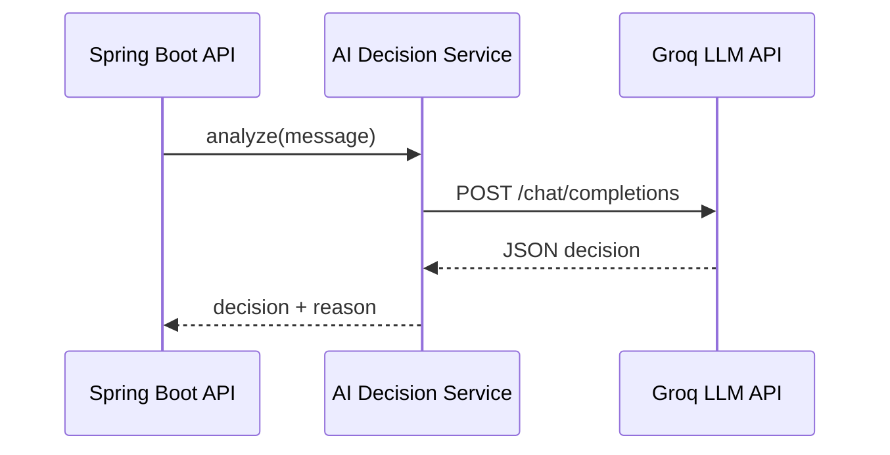
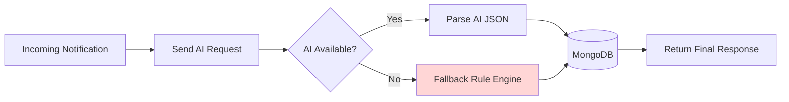
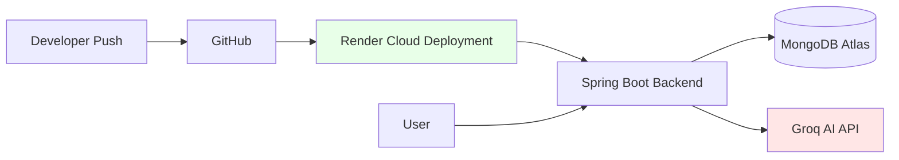

# AI Notification Prioritization Engine — Spring Boot


This project is a production-ready AI-powered Notification Prioritization Engine designed to intelligently classify and manage incoming notifications using Large Language Models (LLMs).

The system analyzes notification content in real time and assigns priority levels through an AI-driven decision engine supported by a fail-safe architecture to ensure reliability and continuous operation.

---

## 🧭 System Overview


---
## 🏗 High-Level Architecture


---
# ✅ 2️⃣ REQUEST PROCESSING FLOW

```md
## 🔄 Request Processing Flow


✅ Directly proves **fail-safe logic requirement**.

---
# ✅ 3️⃣ AI INTEGRATION ARCHITECTURE

```md
## 🤖 AI Integration Architecture


> ✅ Shows real AI integration (important requirement).
---
# ✅ 4️⃣ FAIL-SAFE ARCHITECTURE

```md
## 🛡 Fail-Safe Decision Architecture


> ✅ "Complete fail-safe architecture with fallback mechanisms"
---
## 🔐 Fail-Safe Design

The system guarantees availability using:

AI timeout protection

JSON validation layer

Exception-safe parsing

Automatic fallback decision engine

Always-return response strategy

---

## 🚀 Features

- Spring Boot REST API
- MongoDB database integration
- Real AI classification using Groq LLM
- Automatic fallback mechanism
- Swagger API documentation
- Production-safe error handling

---
## 🛠 Tech Stack

- Java 17+
- Spring Boot
- MongoDB
- WebClient
- Groq AI API
- Maven

---

## 🧠 How It Works

1. Client sends notification
2. Backend calls AI model
3. AI classifies priority
4. Result stored in MongoDB
5. Response returned instantly

If AI fails → fallback decision ensures reliability.

---

✅ Shows full backend pipeline instantly.

---

## 📡 API Endpoints

### Health Check
GET `/health`

### Process Notification
POST `/api/notifications/process`

Example:

```json
{
  "userId": "101",
  "message": "Server outage detected",
  "context": "production"
}
```
---
## ⚙️ Setup Guide (Local Run)
1️⃣ Clone Repository
```
git clone https://github.com/your-username/notification-engine-springboot.git
cd notification-engine-springboot
```
2️⃣ Configure Environment
Update application.properties:
```
groq.api.url=https://api.groq.com/openai/v1/chat/completions
groq.api.key=YOUR_API_KEY
```
3️⃣ Run Application
```
mvn spring-boot:run
```
Server starts at:

http://localhost:8080

Swagger UI:

http://localhost:8080/swagger-ui.html


---

# ☁ Deployment

The application is designed to be cloud-deployable with environment-based configuration and production-safe startup settings.

## 🌐 Live Architecture

- Backend deployed as a cloud web service
- MongoDB hosted using MongoDB Atlas
- AI classification powered by Groq LLM API
- Environment variables used for secure configuration

# ✅ 5️⃣ DEPLOYMENT ARCHITECTURE

```md
## ☁ Deployment Architecture


---
## 📦 Deployment Design Principles
    Stateless backend architecture
    Externalized configuration
    Fail-safe AI integration
    Cloud-ready build process
    Zero hardcoded secrets
---

## 🚀 Backend Deployment

The Spring Boot application can be deployed on platforms such as:

- Render
- Railway
- AWS
- Docker-based cloud environments

> Here I used Render
---
### Build Command

```bash
./mvnw clean package
```
Start Command
```
java -jar target/*.jar
```
---
## Environment Variables
The following must be configured in the deployment platform:
```
groq.api.url=http://api.groq.com/openai/v1/chat/completions
groq.api.key=YOUR_API_KEY
```