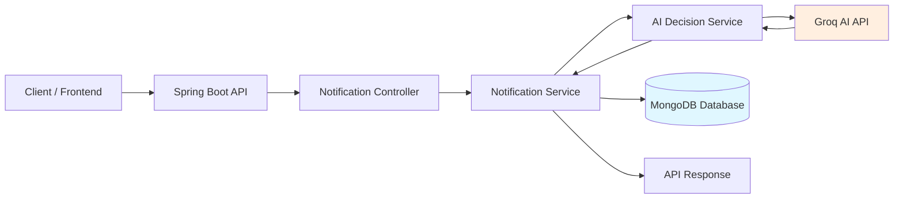
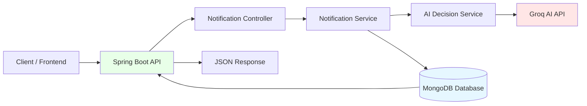
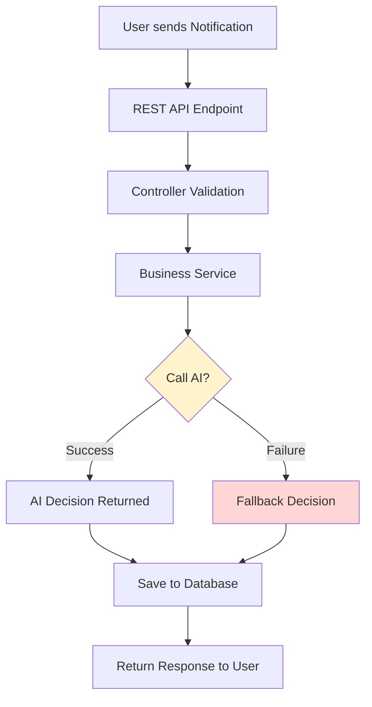
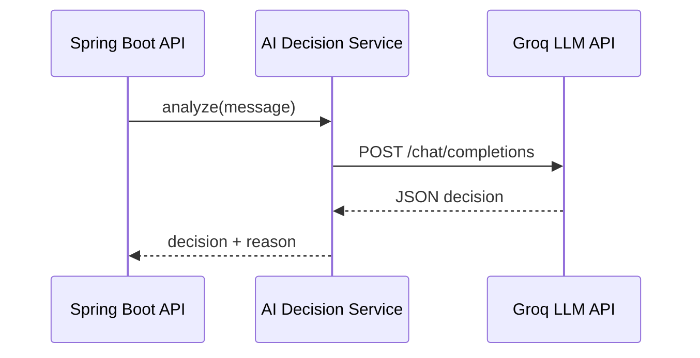
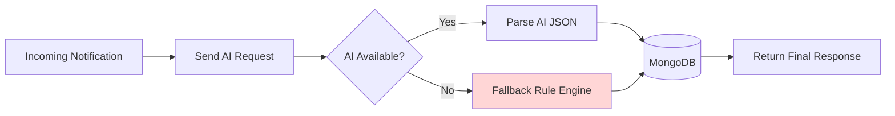
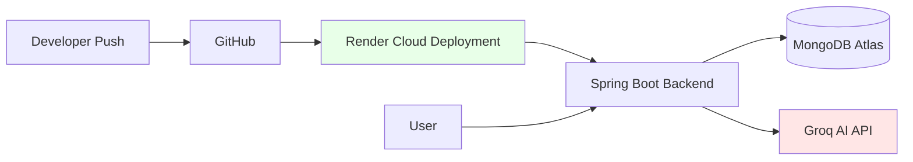

# AI Notification Prioritization Engine — Spring Boot

This project is a production-ready AI-powered Notification Prioritization Engine developed for the **Cyepro Solutions AI/ML Engineer Build & Ship Test**.

The system analyzes incoming notifications using a real AI model and assigns priority levels with a fail-safe architecture.

---

## 🚀 Features

- Spring Boot REST API
- MongoDB database integration
- Real AI classification using Groq LLM
- Automatic fallback mechanism
- Swagger API documentation
- Production-safe error handling

---

## 🧠 How It Works

1. Client sends notification
2. Backend calls AI model
3. AI classifies priority
4. Result stored in MongoDB
5. Response returned instantly

If AI fails → fallback decision ensures reliability.

---

## 🧭 System Overview


---

## 🛠 Tech Stack

- Java 17+
- Spring Boot
- MongoDB
- WebClient
- Groq AI API
- Maven

---
## 🏗 High-Level Architecture


---

✅ Shows full backend pipeline instantly.

---

## 📡 API Endpoints

### Health Check
GET `/health`

### Process Notification
POST `/api/notifications/process`

Example:

```json
{
  "userId": "101",
  "message": "Server outage detected",
  "context": "production"
}
```
## 🔐 Fail-Safe Design

AI timeout protection

JSON validation

Exception-safe parsing

Guaranteed API response

# ✅ 2️⃣ REQUEST PROCESSING FLOW

```md
## 🔄 Request Processing Flow


✅ Directly proves **fail-safe logic requirement**.

---

# ✅ 3️⃣ AI INTEGRATION ARCHITECTURE

```md
## 🤖 AI Integration Architecture


> ✅ Shows real AI integration (important requirement).

---

# ✅ 4️⃣ FAIL-SAFE ARCHITECTURE (VERY IMPORTANT FOR EVALUATION)

```md
## 🛡 Fail-Safe Decision Architecture


> ✅ "Complete fail-safe architecture with fallback mechanisms"

# ✅ 5️⃣ DEPLOYMENT ARCHITECTURE

```md
## ☁ Deployment Architecture

