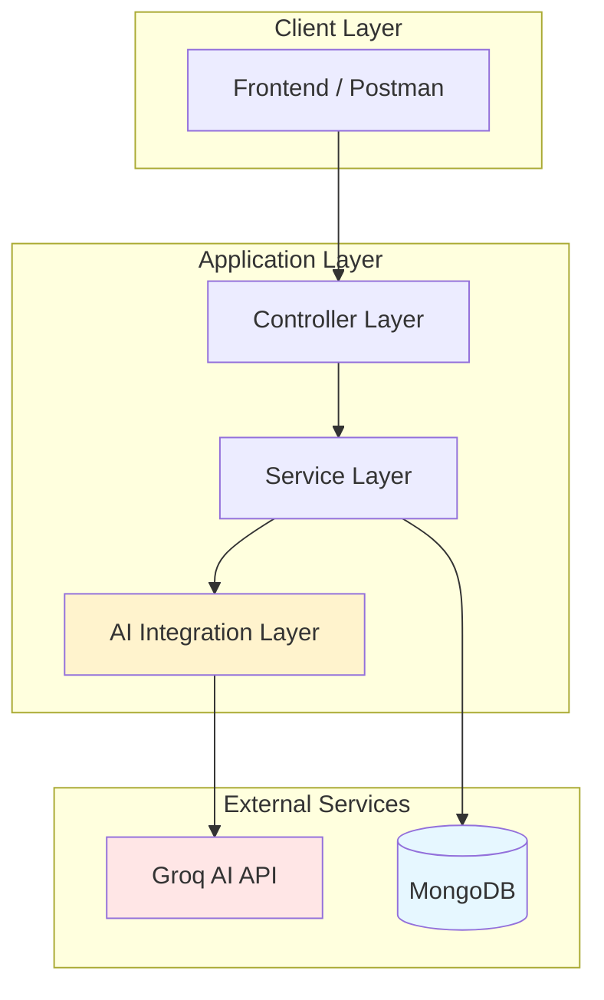

# Architecture Decisions
```md
## 🏗 System Architecture


> This screams **enterprise architecture**

## Spring Boot
Chosen for scalable enterprise backend architecture.

## MongoDB
Flexible schema suitable for dynamic notification data.

## WebClient
Used for non-blocking AI API communication.

## AI Integration
Groq LLM used for real-time notification classification.

## Fail-Safe Strategy
AI systems may fail or return invalid responses.
Fallback logic guarantees uninterrupted service.