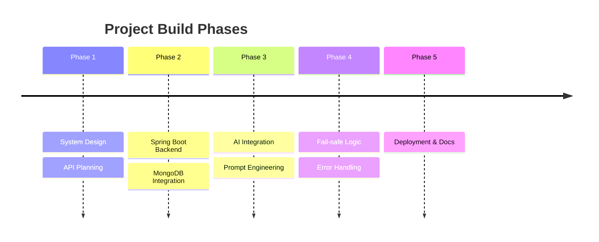

# Build Plan

```md
## 📈 Development Timeline



## Phase 1 — Design
- Define notification prioritization system
- Create API structure

## Phase 2 — Backend Development
- Spring Boot setup
- MongoDB integration
- REST controllers

## Phase 3 — AI Integration
- Groq API integration
- Prompt engineering
- Response parsing

## Phase 4 — Reliability
- Fallback mechanism
- Exception handling
- Timeout protection

## Phase 5 — Deployment & Documentation
- Cloud deployment
- Documentation preparation
