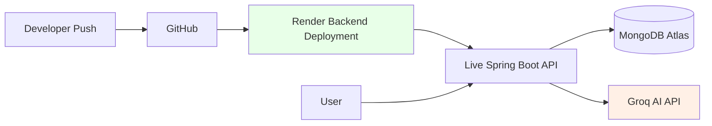

# Deployment Guide

## Backend Deployment (Render)

1. Push repository to GitHub
2. Create Web Service on Render
3. Connect repository

### Build Command
./mvnw clean package

### Start Command
java -jar target/*.jar

---

## Environment Variables

groq.api.key=YOUR_API_KEY
groq.api.url=https://api.groq.com/openai/v1/chat/completions

---

## Health Endpoint

/health

```md
## ☁ Deployment Architecture

