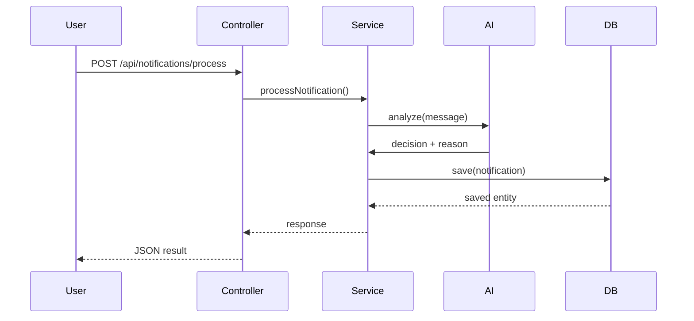
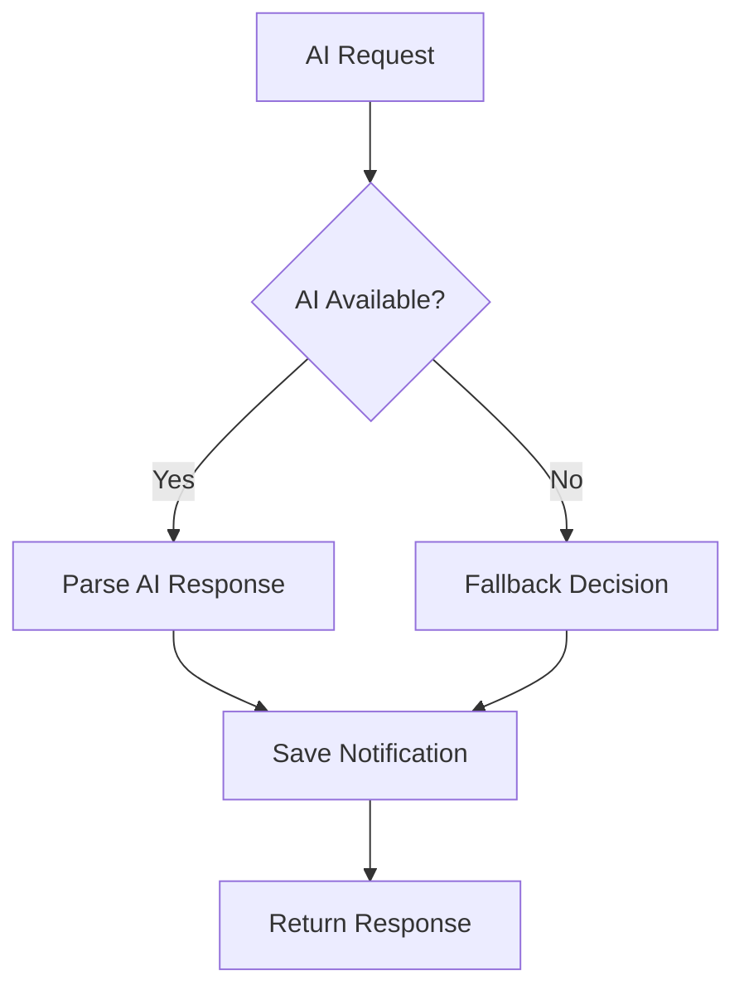

```md
# System Workflow

```md
## 🔄 Notification Processing Workflow


## Request Flow

1. User sends notification request
2. NotificationController receives API call
3. NotificationService processes request
4. AiDecisionService calls Groq AI API
5. AI returns classification
6. Result stored in MongoDB
7. Response returned to client

---

## Fail-Safe Workflow

If AI fails:
- fallback decision applied
- system continues execution
- API never crashes


> 🔥 This diagram directly proves **fail-safe architecture requirement**.
